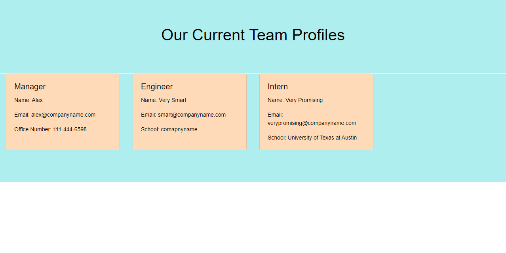

# Team Profile Generator

## License:

## Table of Contents
1. [Description](#description)

2. [Installation](#installation)

3. [Usage](#usage)

4. [Testing](#testing)

5. [Contribution](#contribution)

6. [Questions](#questions)

## Description 
In this project, I developed an employee profile generator using Node.js to dynamically generate an HTML file. This application uses Inquirer and Fs to run this back-end application. A link to the video be found [here](#usage)

## Installation 
This project requires users to have Node, Inquirer and Fs installed on the workbench. After this is complete, you should right click the index.js file, open the integrated terminal, and run the following commands: 

1. "npm i install"
2. "npm i inquirer"
3. "node index.js"

Congrats! You have an interactive app to generate team profiles. Due to the lack of a front-end, the video below will show how the HTML page will be dynamically generated.

## Usage 
Dynamically generated HTML Website: https://drive.google.com/file/d/12gDG5Bb2bXdnMG9zH4uL_tAAWETcOA6d/view?usp=sharing

This product can be used as to generate, track, and visualize the employee pool of any business. Furthermore, it is a template for setting up a fully-functional app to add employees to an existing database. This idea is under development.

## Testing 
This application has no tests.

## Contribution 
This project's front-end design is a work in progress, so any input or suggestions will be reviewed and implemented if appropriate. The project is expected to be expanded upon following the graduation of the Coding Bootcamp at UT Austin in December of 2021.

## Questions 
Feel free to email me at: alexis.gonzalez07@gmail.com

Visit my Github profile at: [Alex Gonzalez Github](https://www.github.com/AlexisGonzalez07)